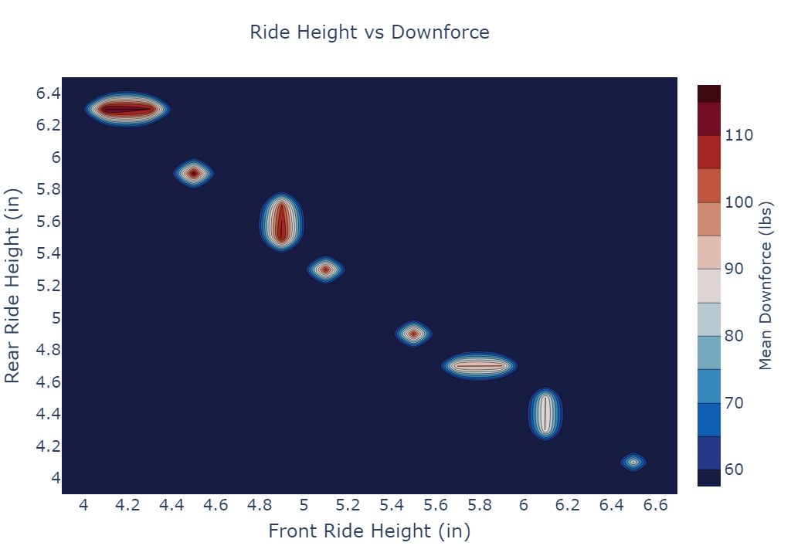

# Dallas Formula Racing Aeromap Scripts

Python script to process and visualize aerodynamic performance of the vechicle through different simulations

The main purpose is to create an 'aeromap' which allows us to analysze how the car performs through various rideheights and crosswinds.
The visualized aeromap is a 2d graph where x and y axes are front and rear ride heights respectively, and the z axis is the mean downforce value.

## More Info

Please see the combined detailed design report for more information. HPC analysis and code details are specifically the last 17 pages though the aeromap spans the full 51.
[DDR Report](https://github.com/bellh14/DFR-Aeromap/blob/master/documentation/2024%20Aerodynamics%20DDR-combined.pdf)

## Java Macros

Uses StarCCM+'s Java api to change input parameters in the CFD simulation. Different versions for sweeping through single variable, 2 variable, and Yaw Angle Cases.

## Python Script

Our simualtions output each iteration as a csv file, so this script merges all iterations together into a single csv file.
Since our input parameters do not have symmetric inputs and currently allign in a line where front and rear ride heights are inversly proportional, we can not use built in methods to plot the data in a heatmap / contour plot. Those require the z axis to be a M * N dimension array where M and N are the lengths of the x and y axes respectively.

Instead we take each iteration in the data frame and copy it n times into a new data frame where n is the rounded downforce value of that iteration, so an interation with a downforce value os 120 will be represented in the new data frame 120 times. This allows us to plot the data as a 2d histogram  with the z axis being the downforce value.

## Even More Documentation

### *Primarily for new members in DFR, but may be useful to others*

For any information on how we connected and utilized our HPC resources, please see the documentation folder. This contains an additional 50 pages of documentation aside from the combined DDR report.
